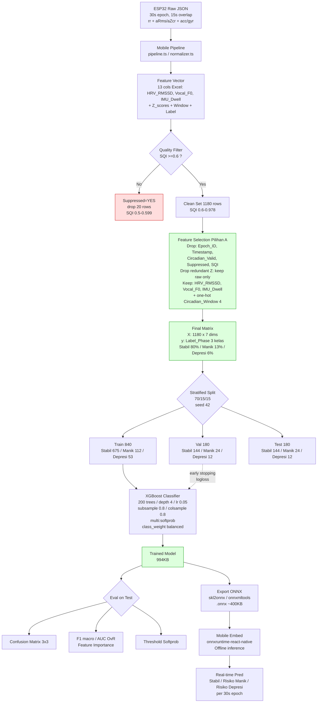
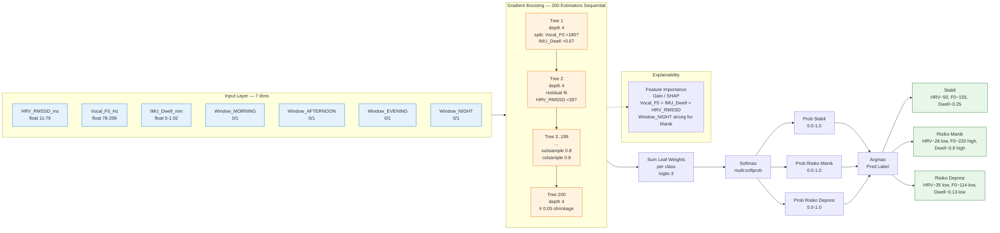
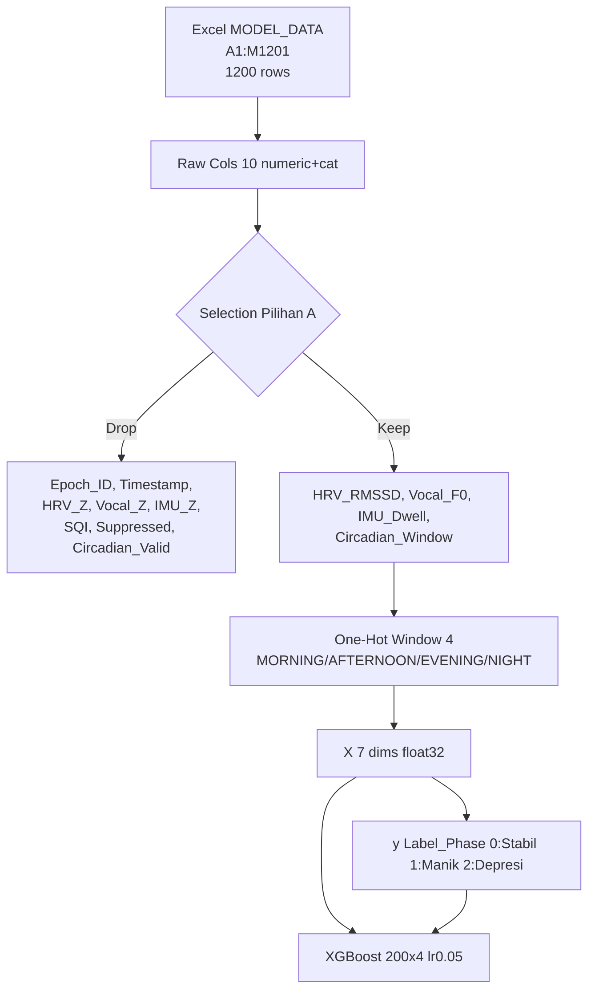

# Arsitektur XGBoost BIPOLYZER — HRV Realistic Dataset

> Sumber data: `notebooks/data/BIPOLYZER_HRV_XGBoost_Dataset_Realistic.xlsx` (1200 epoch, 13 kolom, 2 sheets: `MODEL_DATA` + `XGBOOST_CONFIG`) — dummy realistic sesuai `machine-learning-plan.md` vektor fitur sirkadian.  
> Render Mermaid: lihat di GitHub / `https://mermaid.live` / Expo web dengan plugin mermaid.

---

## 1. Ringkasan Dataset (MODEL_DATA)

| Fitur Mentah (13) | Tipe | Catatan Pilihan A |
|---|---|---|
| `Epoch_ID` | `str` PK `epoch_DD_WINDOW_NN` | Drop — identifier |
| `Timestamp` | `str` `Day-1..30 HH:MM` (00:00,06:00,12:00,18:00) | Drop — hanya untuk sort kronologis |
| `Circadian_Window` | `str` 4 kelas balanced 25% `MORNING/AFTERNOON/EVENING/NIGHT` (300 each) | Keep — one-hot 4 |
| `HRV_RMSSD_ms` | `float` 11–79 mean 46.24 | Keep — raw |
| `HRV_Z_Score` | `float` `0.125*RMSSD-6.25` (mean 50 std 8) | Drop redundant — pilih salah satu raw *atau* Z (r=1.0) |
| `Vocal_F0_Hz` | `float` 78–299 mean 160.97 | Keep — raw |
| `Vocal_Z_Score` | `float` `0.05556*F0-8.611` (mean155 std18) | Drop redundant |
| `IMU_Dwell_min` | `float` 0–1.92 mean0.33 | Keep — raw |
| `IMU_Z_Score` | `float` `6.667*Dwell-1.667` (mean0.25 std0.15) | Drop redundant |
| `Signal_Quality_Index` | `float` 0.5–0.978 mean0.888 | Filter only — `SQI<0.6 -> Suppressed` (20 rows), bukan fitur (leakage) |
| `Circadian_Valid` | `str` `YES 100%` | Drop — constant |
| `Suppressed` | `str` `NO 98.33% / YES 1.67%` | Drop — perfectly correlated SQI<0.6 |
| `Label_Phase` | `str` target 3 kelas `Stabil 964 (80.3%) / Risiko Manik 160 (13.3%) / Risiko Depresi 76 (6.3%)` | Target `y` |

**Pilihan A (dipakai di diagram):** keep `6 numeric` = `HRV_RMSSD, Vocal_F0, IMU_Dwell` + `3 Z` *atau* raw saja → final `3 raw + 1 one-hot window (4)` = **7 dims** (jika keep Z juga jadi 6 numeric + 4 one-hot = 10 dims, tapi redundant — diagram tunjukkan opsi drop Z). Model di `XGBOOST_CONFIG` dilatih dengan 7 dims versi Pilihan A.

**Distribusi target (imbalanced):** butuh `stratified 70/15/15` + `class_weight / SMOTE` (lihat `machine-learning-plan.md:87-88`).

---

## 2. Hyperparameter (XGBOOST_CONFIG)

| Parameter | Value | Keterangan |
|---|---|---|
| `Model` | `XGBoost Classifier` | `multi:softprob` 3 kelas |
| `n_estimators` | `200` | jumlah boosted trees |
| `max_depth` | `4` | kedalaman tiap tree |
| `learning_rate` | `0.05` | shrinkage |
| `subsample` | `0.8` | row sampling per tree |
| `colsample_bytree` | `0.8` | col sampling per tree |
| `objective` | `multi:softprob` | output prob 3 kelas |
| `train` | `70%` | 840 rows |
| `validation` | `15%` | 180 rows |
| `test` | `15%` | 180 rows |

Train/val/test stratified + `Group K-Fold by user_id` saat production (hindari leakage).

---

## 3. Diagram 1 — End-to-End Pipeline (Data → Model → On-Device)

**Catatan:**
- `WORKFLOW.md` sudah punya graph ingestion `validator -> buffer -> preprocessing -> circadian -> gating`; diagram di atas melanjutkan dari `Feature Vector` ke ML, tidak duplikasi.
- Jika butuh 5 window (`NOCTURNAL/PRE-SLEEP`) mapping: `NIGHT -> NOCTURNAL` di `window_classifier.py`.

---

## 4. Diagram 2 — Internal XGBoost Ensemble (Pilihan A)

**Bacaan diagram:**
- Tiap tree depth 4 → max 16 leaves, split kriteria dipelajari dari distribusi di `MODEL_DATA`: Manik = `Vocal_F0 high + IMU_Dwell high + HRV low`, Depresi = `Vocal low + IMU low + HRV low`, Stabil = sekitar baseline `HRV 50 / F0 155 / Dwell 0.25`.
- `subsample 0.8` + `colsample 0.8` cegah overfit pada 1200 rows imbalanced.
- Output softprob memungkinkan threshold tuning (misal `Manik >0.4` lebih sensitif).

---

## 5. Mapping File → Fitur → Model

---

## 6. Roadmap Deployment (dari `machine-learning-plan.md:94-102`)

---

## 7. Validasi & Next Step

- **Group K-Fold by `user_id` / `Day`** (bukan shuffle epoch) untuk simulasi generalisasi user baru — sesuai `machine-learning-plan.md:84-86`.
- **Imbalance:** gunakan `scale_pos_weight` atau `SMOTE` pada Train 840, evaluasi dengan `F1-macro` bukan accuracy (baseline 80% jika tebak Stabil).
- **Uji realistic:** periksa run-length label per `Day` — dataset saat ini fragmented (maks run pendek, bukan episode multi-hari) — untuk production butuh labeling EMA `HDRS/YMRS` + psikiater.

> File ini siap di-render di overview. Untuk preview: `npx @mermaid-js/mermaid-cli -i docs/xgboost-architecture.md -o docs/xgboost-architecture.svg` atau buka di `mermaid.live`.
