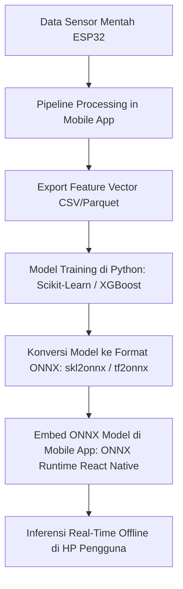

# 🤖 Rencana & Strategi Machine Learning (BIPOLYZER Circadian Algorithm)

Dokumen ini memuat perancangan sistem Machine Learning (ML), kebutuhan data, strategi pelabelan (*ground truth*), ukuran sampel yang dibutuhkan, hingga peta jalan (*roadmap*) eksekusi untuk modul pengklasifikasi mood sirkadian downstream.

---

## 1. Pemilihan Metode Machine Learning

Berdasarkan arsitektur fitur multi-modal sirkadian (HRV, Vocal, IMU, dan Jendela Waktu Biologis), metode ML dibagi menjadi dua kategori utama:

### A. Model Utama: Random Forest & XGBoost (Supervised Learning)
* **Peran:** Mengklasifikasikan fase mood pengguna berdasarkan vektor fitur sirkadian yang sudah divalidasi.
* **Alasan Pemilihan:**
  * Sangat andal untuk **data tabular** dengan fitur kombinasi (Z-score HRV, Vocal, dan IMU).
  * Menghasilkan **Feature Importance** (membantu menjelaskan faktor mana yang paling dominan mengindikasikan episode mood).
  * **Ringan & Hemat Daya:** Model yang terlatih dapat dikonversi ke format **ONNX** untuk inferensi langsung (*On-Device ML*) di dalam HP pengguna secara offline.

### B. Model Tambahan: Isolation Forest (Unsupervised Anomaly Detection)
* **Peran:** Deteksi dini risiko kecenderungan relapse/anomali tanpa membutuhkan label medis dari dokter.
* **Alasan Pemilihan:**
  * Cukup dilatih dengan **7 hari data baseline normal** pengguna.
  * Otomatis memberi peringatan jika terdapat deviasi sirkadian yang tajam (misal: insomnia dipadu lonjakan aktivitas vokal malam hari).

### C. Model Tingkat Lanjut: LSTM / GRU (Time-Series Sequence Model)
* **Peran:** Mempelajari deret waktu biologis 24–48 jam secara beruntun.
* **Alasan Pemilihan:** Memahami pola ketergantungan temporal jangka panjang dalam siklus harian.

---

## 2. Kebutuhan Data (Data Requirements)

### Fitur Input (Features Vector)
Setiap sampel/epoch data mentah dari sensor ESP32 yang telah diproses oleh `pipeline.ts` menghasilkan vektor fitur berikut:

| Kategori Fitur | Nama Variabel | Deskripsi / Satuan |
| :--- | :--- | :--- |
| **HRV** | `hrv_rmssd` | Root Mean Square of Successive Differences (ms) |
| **HRV** | `hrv_zscore` | Deviasi HRV terhadap baseline jendela biologis |
| **Vocal** | `vocal_f0` | Fundamental Frequency suara (Hz) |
| **Vocal** | `vocal_zscore` | Deviasi nada suara terhadap baseline |
| **IMU** | `imu_dwell_min` | Waktu diam/keaktifan (0.0 = Aktif, 0.5 = Diam) |
| **IMU** | `imu_zscore` | Deviasi keaktifan gerak terhadap baseline |
| **Circadian** | `window_name` | Jendela Biologis (`MORNING`, `AFTERNOON`, `EVENING`, `PRE_SLEEP`, `NOCTURNAL`) |
| **Quality/Gating**| `circadian_valid` | Status kelayakan data (`1` = Valid, `0` = Tersuppresi) |

---

## 3. Ukuran Sampel Data yang Dibutuhkan (Sample Size)

Perekaman sensor dilakukan per **30 detik (1 epoch)**.
* **1 Hari Perekaman** $\approx$ **2.880 epoch data** (jika dipakai kontinu 24 jam).

| Tahapan Pengembangan | Jumlah Subjek/Pengguna | Durasi Perekaman per Subjek | Total Volume Data (Epoch) | Tujuan |
| :--- | :--- | :--- | :--- | :--- |
| **Proof of Concept (PoC)** | 3 – 5 Pengguna | 7 Hari | $\approx 60.000 - 100.000$ epoch | Eksperimen awal & pemodelan baseline |
| **Model Benchmark / Beta** | 10 – 15 Pengguna | 14 Hari | $\approx 400.000 - 600.000$ epoch | Validasi performa Random Forest / XGBoost |
| **Model Production (Klinis)** | 30+ Pengguna | 30 Hari | $\ge 2.500.000$ epoch | Akurasi tinggi & generalisasi antar subjek |

---

## 4. Struktur Pelabelan (Ground Truth & Labeling Strategy)

### Target Label (Multi-Class Targets)
Model dikembangkan untuk memprediksi **4 Kelas Utama**:

| Kode Label | Nama Kelas | Deskripsi Kondisi Medis/Mood |
| :---: | :--- | :--- |
| **`0`** | **Euthymia** | Kondisi normal, stabil, dan ritme sirkadian seimbang. |
| **`1`** | **Depressive Phase** | Episode depresi (HRV turun, aktivitas vokal & fisik sangat rendah). |
| **`2`** | **Manic / Hypomanic Phase** | Episode mania (Aktivitas fisik tinggi nocturnal, nada suara melonjak). |
| **`3`** | **Mixed State / High Stress** | Kondisi campuran (Stres tinggi, kecemasan akut, ketidakstabilan otonom). |

### 📝 Metode Pengumpulan Label Ground Truth
1. **Daily Self-Report EMA (Ecological Momentary Assessment):**
   * Aplikasi mobile menampilkan kuesioner singkat 1x atau 2x sehari (misal: versi ringkas skala HDRS / YMRS / AltMAN / PHQ-9).
   * Pengguna menginput skor mood harian sebagai label supervisor.
2. **Clinical Assessment (Gold Standard):**
   * Labeling dan asesmen periodik oleh psikiater/dokter spesialis kesehatan jiwa saat sesi konsultasi.

---

## 5. Strategi Validasi & Training Model

1. **Group K-Fold Cross-Validation:**
   * Pembagian *train/test split* dilakukan berdasarkan `user_id` (bukan acak per epoch).
   * Hal ini mencegah *Data Leakage* (model tidak boleh melihat data dari user yang sama saat pengujian untuk memastikan model dapat digeneralisasi ke pengguna baru).
2. **Penanganan Imbalance Data (SMOTE / Class Weighting):**
   * Karena episode normal (*Euthymia*) biasanya lebih dominan daripada episode *Mania/Depresi*, diterapkan teknik pembobotan kelas (*Class Weighting*) atau *SMOTE* saat training.

---

## 6. Peta Jalan Implementasi ke Aplikasi Mobile (Deployment Roadmap)

1. **Pengumpulan Data Awal:** Mengumpulkan data sensor dari 3 unit ESP32 yang sudah dibuat.
2. **Pelatihan di Python:** Menggunakan `scikit-learn` & `xgboost` untuk melatih model Random Forest/XGBoost di Jupyter Notebook.
3. **Ekspor Model:** Menyimpan model berformat `.onnx` yang sangat efisien.
4. **Eksekusi di HP:** Memasang paket `onnxruntime-react-native` pada aplikasi mobile agar analisis mood berjalan **100% offline dan privat di perangkat HP pengguna**.
