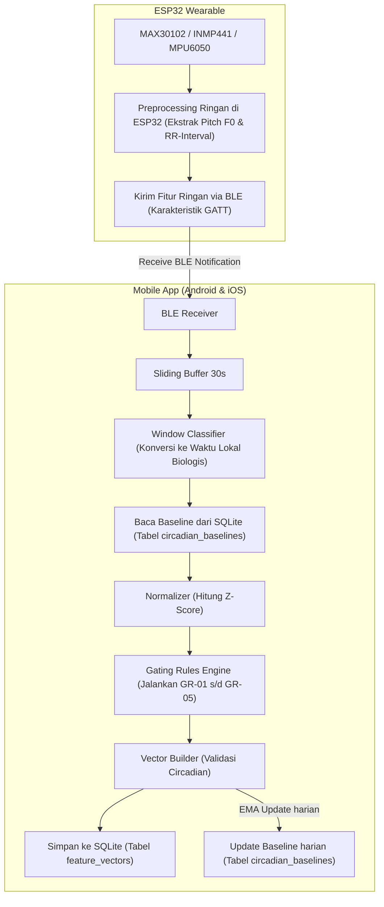

# BIPOLYZER Mobile Application (Android & iOS)

Aplikasi mobile BIPOLYZER dirancang sebagai aplikasi standalone lintas platform yang bertindak sebagai hub pengolah data sensor secara lokal dari wearable device (ESP32) menggunakan koneksi Bluetooth Low Energy (BLE), menyimpan data dan baseline ke dalam database SQLite lokal di smartphone, serta menjalankan algoritma klasifikasi jendela biologis (Circadian) dan Gating secara real-time.

---

## 1. Tech Stack

Aplikasi mobile ini dibangun menggunakan teknologi modern yang berfokus pada efisiensi daya, performa native, dan kapabilitas offline-first:

| Komponen | Teknologi | Alasan |
| :--- | :--- | :--- |
| **Framework Utama** | React Native (Expo SDK) | Pengembangan lintas platform (iOS & Android) dengan kinerja native yang cepat dan tooling Expo yang matang. |
| **Bahasa Pemrograman**| TypeScript | Menjamin keamanan tipe data (type-safety) selama porting kontrak data dari Python. |
| **Koneksi Bluetooth** | `react-native-ble-plx` | Library BLE terlengkap untuk React Native yang mendukung sinkronisasi background dan pertukaran data GATT secara asinkron. |
| **Database Lokal** | `expo-sqlite` | Driver SQLite native yang ringan untuk penyimpanan data baseline personal dan riwayat fitur secara offline. |
| **State Management** | Zustand | State management minimalis, cepat, dan mudah diintegrasikan dengan sinkronisasi data BLE. |
| **Grafik & SVG** | `react-native-svg` | Rendering grafik tren (HRV, Vokal, Mood) langsung via SVG native tanpa library charting pihak ketiga. |
| **Push Notification** | `expo-notifications` | Local push notification terjadwal untuk fitur Reminder (minum obat & olahraga) secara offline. |
| **Keamanan Biometrik** | `expo-local-authentication` | Akses Face ID / Fingerprint untuk autentikasi layar kunci. |
| **Penyimpanan Aman** | `expo-secure-store` | Enklave penyimpanan aman untuk menyimpan hash PIN agar tidak terbaca aplikasi lain. |
| **Desain Antarmuka** | React Native StyleSheet | Styling native berbasis StyleSheet dengan palet warna ungu premium (dark-light theme). |

---

## 2. Alur Pengiriman BLE & Pemrosesan Data

Sistem pengiriman menggunakan skema **Batch Transmission (Setiap 15 Detik Sekali)** untuk menyeimbangkan performa transfer data dan efisiensi daya baterai pada wearable device.

### Diagram Alur Data (End-to-End)


### Detil Protokol BLE GATT:
- **Service UUID:** `19B10000-E8F2-537E-4F6C-D104768A1214`
- **Karakteristik & Payload:**
  - **HRV (Notify) - `19B10001-...`:** Mengirim array RR-Interval (float32 list) yang di-serialize menjadi string JSON kecil.
  - **Vocal (Notify) - `19B10002-...`:** Mengirim nilai rata-rata F0 dan intensitas suara.
  - **IMU (Notify) - `19B10003-...`:** Mengirim nilai keaktifan (activity level, transitions, dan dwell time).
- **Fragmentasi Paket:** Untuk payload di atas MTU default (~20 bytes), paket dipecah dengan format header: `[Sequence ID (1 byte)] [Total Packets (1 byte)] [Payload]`.

---

## 3. Skema Database SQLite Lokal

Database SQLite lokal pada perangkat HP bertindak sebagai penyimpan data jangka pendek untuk kalkulasi baseline adaptif dan audit log.

### A. Tabel `circadian_baselines`
Menyimpan baseline adaptif (mean & std) per window untuk proses normalisasi z-score.
```sql
CREATE TABLE IF NOT EXISTS circadian_baselines (
    window_name TEXT PRIMARY KEY,
    hrv_rmssd_mean REAL NOT NULL,
    hrv_rmssd_std REAL NOT NULL,
    vocal_f0_mean REAL NOT NULL,
    vocal_f0_std REAL NOT NULL,
    imu_dwell_mean REAL NOT NULL,
    imu_dwell_std REAL NOT NULL,
    updated_at DATETIME DEFAULT CURRENT_TIMESTAMP
);
```

### B. Tabel `feature_vectors`
Menyimpan riwayat vektor fitur yang lolos/gagal validasi sirkadian.
```sql
CREATE TABLE IF NOT EXISTS feature_vectors (
    epoch_id TEXT PRIMARY KEY,
    timestamp TEXT NOT NULL,
    window_name TEXT NOT NULL,
    hrv_rmssd REAL,
    hrv_zscore REAL,
    vocal_f0 REAL,
    vocal_zscore REAL,
    imu_dwell_min REAL,
    imu_zscore REAL,
    circadian_valid INTEGER NOT NULL,  -- 0 = False, 1 = True
    suppressed_reason TEXT,
    created_at DATETIME DEFAULT CURRENT_TIMESTAMP
);
```

### C. Tabel `mood_logs` *(Baru — Fitur Mood Tracker)*
Menyimpan input skala mood harian dari pengguna (1–10).
```sql
CREATE TABLE IF NOT EXISTS mood_logs (
    log_id TEXT PRIMARY KEY,
    logged_date TEXT NOT NULL,       -- format: YYYY-MM-DD
    mood_score INTEGER NOT NULL,     -- skala 1-10
    note TEXT,                       -- catatan opsional
    created_at DATETIME DEFAULT CURRENT_TIMESTAMP
);
```

### D. Tabel `reminders` *(Baru — Fitur Reminder)*
Menyimpan jadwal pengingat yang dibuat pengguna.
```sql
CREATE TABLE IF NOT EXISTS reminders (
    reminder_id TEXT PRIMARY KEY,
    label TEXT NOT NULL,             -- contoh: 'Minum Obat Pagi'
    type TEXT NOT NULL,              -- 'medication' | 'exercise'
    time TEXT NOT NULL,              -- format: HH:MM
    repeat_days TEXT NOT NULL,       -- JSON array, contoh: '["Mon","Wed","Fri"]'
    is_active INTEGER DEFAULT 1,     -- 0 = off, 1 = on
    notification_id TEXT,            -- ID dari expo-notifications untuk cancel
    created_at DATETIME DEFAULT CURRENT_TIMESTAMP
);
```

### E. Tabel `gamification_progress` *(Baru — Fitur Gamifikasi)*
Menyimpan akumulasi poin dan badge yang sudah diraih pengguna.
```sql
CREATE TABLE IF NOT EXISTS gamification_progress (
    user_id TEXT PRIMARY KEY DEFAULT 'local_user',
    total_points INTEGER DEFAULT 0,
    streak_days INTEGER DEFAULT 0,
    last_active_date TEXT,           -- format: YYYY-MM-DD
    badges_unlocked TEXT DEFAULT '[]', -- JSON array nama badge
    updated_at DATETIME DEFAULT CURRENT_TIMESTAMP
);
```

---

## 4. Struktur Folder Project (React Native Tree)

Kerangka proyek di bawah direktori `mobile/` ditata secara modular untuk memisahkan logika UI, BLE, Database, dan Algoritma Sirkadian (Porting dari Python):

```
mobile/
│
├── MOBILE.md                    ← Dokumen ini
├── package.json
├── tsconfig.json
├── App.tsx                      ← Entrypoint & navigasi tab utama
│
├── assets/
│   └── ICON_HOMEPAGE/           ← Ikon PNG custom (heart, mic, moon, dll.)
│
└── src/
    ├── components/              ← UI reusable
    │   ├── BleDeviceCard.tsx
    │   ├── MetricChart.tsx      ← Komponen grafik SVG tren
    │   ├── MoodInputModal.tsx   ← Modal input mood harian
    │   ├── PhaseBanner.tsx      ← Banner kontekstual fase aktif
    │   ├── StreakBadge.tsx      ← Badge streak harian di Beranda
    │   └── StatusIndicator.tsx
    │
    ├── data/
    │   └── education_content.json  ← Konten edukasi per fase (bundled, offline)
    │
    ├── database/                ← Pengelolaan SQLite
    │   ├── sqlite.ts            ← Inisialisasi DB & Eksekusi Query
    │   └── queries.ts           ← CRUD: baselines, feature_vectors,
    │                               mood_logs, reminders, gamification
    │
    ├── services/                ← Background services
    │   ├── bleManager.ts        ← Logika Scan, Connect, dan Listen BLE
    │   ├── syncService.ts       ← Buffer BLE ke SQLite
    │   ├── notificationService.ts ← Scheduling & cancel local push notifications
    │   ├── gamificationService.ts ← Kalkulasi poin & trigger badge
    │   └── authService.ts       ← Verifikasi PIN (hash) & biometrik
    │
    ├── circadian/               ← Porting Logika Python → TypeScript
    │   ├── windowClassifier.ts
    │   ├── baselineManager.ts
    │   ├── normalizer.ts
    │   ├── gatingRules.ts
    │   └── pipeline.ts
    │
    ├── store/                   ← State management (Zustand)
    │   └── useBleStore.ts
    │
    └── views/                   ← Halaman aplikasi
        ├── HomeScreen.tsx       ← Dashboard real-time (Tab Beranda)
        ├── TrenScreen.tsx       ← Grafik HRV, Vokal & Mood (Tab Tren)
        ├── SettingsScreen.tsx   ← Pengaturan & Reminder (Tab Pengaturan)
        ├── HistoryScreen.tsx    ← Riwayat fase sirkadian (Tab Riwayat)
        ├── EdukasiScreen.tsx    ← Daftar artikel edukasi per fase
        ├── EdukasiDetailScreen.tsx ← Konten artikel lengkap
        ├── RewardScreen.tsx     ← Koleksi badge & level gamifikasi
        └── LockScreen.tsx       ← Layar kunci PIN / Biometrik
```

---

## 5. Manajemen Retensi Data (Cache Cleanup)
Untuk mencegah ukuran database SQLite membesar secara eksponensial di perangkat smartphone:
1. **Aturan Retensi:** Data pada tabel `feature_vectors` yang berumur **lebih dari 90 hari** akan dihapus secara otomatis setiap kali aplikasi diaktifkan pertama kali di hari tersebut.
2. **Estimasi Penyimpanan:** Penggunaan data selama 1 minggu menghasilkan sekitar **~11.54 MB** (40.320 baris data). Dengan retensi 90 hari, database hanya akan menggunakan memori berkisar **~150 MB** di dalam penyimpanan HP pengguna.

---

## 6. Roadmap Fitur (Client Requirements)

Berdasarkan hasil diskusi dengan klien, berikut adalah roadmap pengembangan 5 fitur tambahan beserta status dan prioritasnya:

| Prioritas | Fitur | Status | Dependency |
|:---:|:---|:---:|:---|
| 🔴 Tinggi | **Keamanan Data** — Layar kunci PIN & Biometrik | `[ ] Planned` | `expo-local-authentication`, `expo-secure-store` |
| 🔴 Tinggi | **Mood Tracker** — Input mood harian + grafik detail di Tren | `[ ] Planned` | SQLite (tabel `mood_logs`) |
| 🟡 Sedang | **Edukasi** — Konten artikel gejala & pertolongan pertama per fase | `[ ] Planned` | `education_content.json` (bundled) |
| 🟡 Sedang | **Reminder** — Push notification pengingat obat & olahraga | `[ ] Planned` | `expo-notifications` |
| 🟢 Rendah | **Gamifikasi** — Poin, badge, & reward sistem kepatuhan | `[ ] Planned` | ⚠️ Tunggu klarifikasi klien |

### Catatan Gamifikasi
> **Open Question untuk Klien:** Apakah *"unlock feature"* yang dimaksud adalah fitur yang benar-benar terkunci (memerlukan poin untuk membuka akses), atau hanya berupa **visual reward** (badge, level) tanpa memblokir fitur apapun? Jawaban ini sangat menentukan arsitektur dan estimasi waktu pengerjaan.

### Trigger Poin Gamifikasi (Rencana Awal)
| Aksi Pengguna | Poin |
|:---|:---:|
| Buka aplikasi hari ini (streak) | +10 |
| Input mood harian | +15 |
| Baca 1 artikel edukasi | +20 |
| Gelang terhubung (BLE aktif) | +5 |
| Streak 7 hari berturut-turut | +50 (bonus) |
