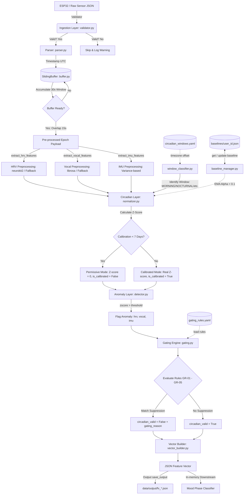

# Workflow & Architecture: BIPOLYZER Circadian Algorithm

Dokumen ini mendokumentasikan arsitektur sistem, aliran data (data flow), dan logika operasional dari pipeline BIPOLYZER Circadian Algorithm.

---

## 1. Diagram Arsitektur (End-to-End Data Flow)

Berikut adalah diagram visual aliran data dari sensor ESP32 hingga menjadi **Circadian-Validated Feature Vector** yang siap dikonsumsi oleh mood classifier downstream:

---

## 2. Rincian Langkah Pipeline (Step-by-Step)

### **Langkah 1: Ingestion Layer (`src/ingestion/`)**
*   **Validation (`validator.py`)**: Memastikan payload JSON dari ESP32 memiliki field wajib (`timestamp`, `user_id`, `hrv_raw`, `audio_raw`, `imu_raw`) dan struktur IMU lengkap.
*   **Parsing (`parser.py`)**: Mengonversi `timestamp` ke standard ISO 8601 UTC format.
*   **Sliding Buffer (`buffer.py`)**: Menyimpan data masuk dalam antrean (stream). Ketika buffer mencapai ukuran jendela **30 detik**, ia menghasilkan satu *epoch* dan menggeser jendela sebanyak **15 detik** (overlap 50%).

### **Langkah 2: Preprocessing Layer (`src/preprocessing/`)**
Mengekstrak metrik domain dari data sensor mentah:
*   **HRV (`hrv.py`)**: Menggunakan `neurokit2` untuk membersihkan PPG dan mendeteksi peak, lalu menghitung `rmssd`, `sdnn`, dan `mean_hr`. Jika library gagal/tidak ada, sistem otomatis menggunakan *Statistical Fallback*.
*   **Vocal (`vocal.py`)**: Menggunakan `librosa` dengan algoritma `pyin` untuk melacak fundamental frequency (`f0_mean`) dan speech rate. Dilengkapi dengan *Statistical Fallback*.
*   **IMU (`imu.py`)**: Menganalisis variansi magnitudo akselerasi untuk menetapkan tingkat aktivitas (`low`, `moderate`, `high`) serta menghitung perubahan postur.

### **Langkah 3: Circadian & Baseline Layer (`src/circadian/`)**
*   **Window Classifier (`window_classifier.py`)**: Membaca profil zona waktu user (misal `Asia/Jakarta`) dari `user_profile.yaml` dan memetakan waktu lokal saat ini ke jendela biologis di `circadian_windows.yaml` (*MORNING*, *AFTERNOON*, *EVENING*, *PRE-SLEEP*, *NOCTURNAL*).
*   **Baseline Manager (`baseline_manager.py`)**: Mengambil riwayat baseline personal pengguna untuk jendela waktu biologis terkait. Jika ini adalah hari baru, baseline diperbarui menggunakan *Exponential Moving Average (EMA)* dengan rumus:
    $$\text{Baseline}_{\text{new}} = \alpha \times \text{Metric}_{\text{current}} + (1 - \alpha) \times \text{Baseline}_{\text{old}}$$
*   **Normalizer (`normalizer.py`)**: Menghitung *Z-Score* penyimpangan fitur saat ini terhadap baseline rata-rata.
    *   *Permissive Mode (Hari 0-6)*: Jika masa kalibrasi belum 7 hari, Z-Score dipaksa ke `0.0` agar tidak memicu deteksi anomali palsu.

### **Langkah 4: Anomaly Detection & Contextual Gating (`src/anomaly/`)**
*   **Detector (`detector.py`)**: Membandingkan nilai Z-score absolut terhadap threshold global (default: `2.0`, dibaca dari `gating_rules.yaml`). Jika melebihi threshold, anomali ditandai (flagged).
*   **Gating (`gating.py`)**: Mengevaluasi aturan penindasan (suppression rules) kontekstual:
    *   **GR-01 (Sleep Window)**: Menolak anomali IMU jika terjadi selama window *NOCTURNAL* (tidur wajar).
    *   **GR-02 (Exercise Pitch)**: Menolak anomali kenaikan suara (pitch) jika IMU mendeteksi aktivitas tinggi (olahraga).
    *   **GR-03 (Post-Meal HRV)**: Menolak penurunan HRV selama *AFTERNOON* / *EVENING* (efek pencernaan setelah makan).
    *   **GR-04 (Morning Activation)**: Menolak anomali HRV/Vocal naik selama *MORNING* (pelepasan kortisol alami).
    *   **GR-05 (Calibration Bypass)**: Jika belum melewati masa kalibrasi 7 hari, status anomali dibypass.

### **Langkah 5: Feature Vector Builder (`src/features/`)**
*   **Vector Builder (`vector_builder.py`)**: Menyusun metadata pipeline (versi, timestamp UTC, user), status gating (`circadian_valid` dan `gating_reason`), serta metrik normalisasi menjadi satu dokumen JSON standar.

---

## 3. Rencana Manajemen Penyimpanan (Future Storage Planning)

Untuk mengantisipasi penumpukan file (overload) di produksi, berikut adalah opsi strategi penyimpanan yang direncanakan:

1.  **Direct Streaming (In-Memory)**:
    *   Menghilangkan fungsi `save_output` dari pipeline produksi.
    *   Output `run_pipeline()` langsung di-pass in-memory ke modul klasifikasi mood.
2.  **Daily JSON Lines (JSONL)**:
    *   Alih-alih membuat file terpisah untuk setiap epoch 15 detik (5,760 file/hari), semua epoch digabung ke dalam satu file log per hari per pengguna: `data/output/{user_id}/{yyyy-mm-dd}.jsonl`.
3.  **Time-To-Live (TTL) & Auto-cleanup**:
    *   Menghapus otomatis file output di folder lokal yang usianya sudah lebih dari 7 hari.
